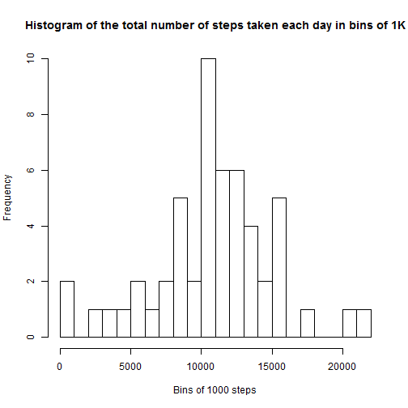
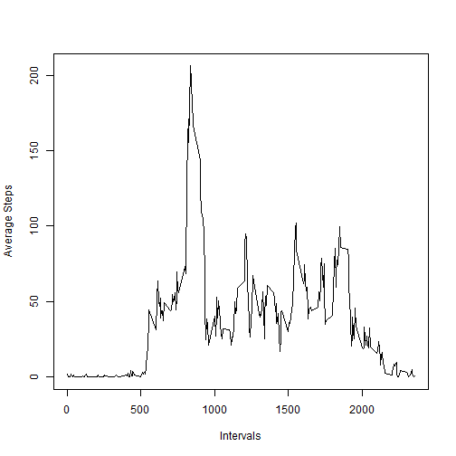
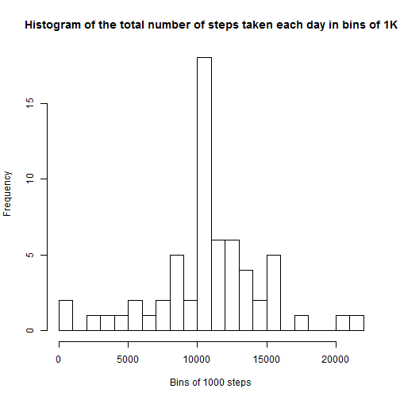
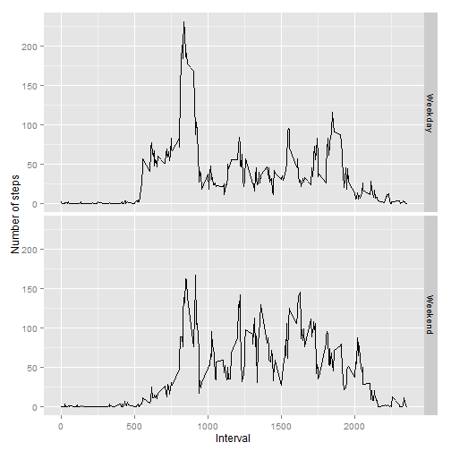

This is the R Markdown document for the first project of the Reproducible Research MOOC course..

This assignment makes use of data from a personal activity monitoring device. This device collects data at 5 minute intervals through out the day. The data consists of two months of data from an anonymous individual collected during the months of October and November, 2012 and include the number of steps taken in 5 minute intervals each day.

Data set can be accessed at [Activity Monitorin Data (52K)](https://d396qusza40orc.cloudfront.net/repdata%2Fdata%2Factivity.zip)

The variables included in this dataset are:

- steps: Number of steps taking in a 5-minute interval (missing values are coded as NA)

- date: The date on which the measurement was taken in YYYY-MM-DD format

- interval: Identifier for the 5-minute interval in which measurement was taken

The dataset is stored in a comma-separated-value (CSV) file and there are a total of 17,568 observations in this dataset.

### Step 1: Loading and preprocessing the data 
Load the data and display the top 5 entries:

```r
activityIN <- read.csv("activity.csv")
head(activityIN, 5)
```

```
##   steps       date interval
## 1    NA 2012-10-01        0
## 2    NA 2012-10-01        5
## 3    NA 2012-10-01       10
## 4    NA 2012-10-01       15
## 5    NA 2012-10-01       20
```

Convert the data to table:

```r
library(data.table)
```

```
## data.table 1.9.4  For help type: ?data.table
## *** NB: by=.EACHI is now explicit. See README to restore previous behaviour.
```

```r
DT <- data.table(activityIN)
```

### Step 2: What is mean total number of steps taken per day?
Calculate the total number of steps taken per day:

```r
stepsPerDay <- DT[, sum(steps), by = date]
head(stepsPerDay)
```

```
##          date    V1
## 1: 2012-10-01    NA
## 2: 2012-10-02   126
## 3: 2012-10-03 11352
## 4: 2012-10-04 12116
## 5: 2012-10-05 13294
## 6: 2012-10-06 15420
```

Create bins of 1000 steps:

```r
nBins = floor((max(stepsPerDay$V1, na.rm=TRUE) - min(stepsPerDay$V1, na.rm=TRUE)) / 1000)
```
and plot the histogram of the total steps per day:

```r
hist(stepsPerDay$V1, breaks=nBins, xlab="Bins of 1000 steps", main="Histogram of the total number of steps taken each day in bins of 1K")
```

 


Calculate and report the mean and median of the total number of steps taken per day:

```r
meanStepsPerDay <- mean(stepsPerDay$V1, na.rm=TRUE)
medianStepsPerDay <- median(stepsPerDay$V1, na.rm=TRUE)

meanStepsPerDay
```

```
## [1] 10766.19
```

```r
medianStepsPerDay
```

```
## [1] 10765
```

### Step 3: What is the average daily activity pattern?
Make a time series plot (i.e. type = "l") of the 5-minute interval (x-axis) and the average number of steps taken, averaged across all days (y-axis)

```r
avr <- aggregate(x=list(Stp=DT$steps), by=list(Intv=DT$interval), FUN=mean, na.rm=TRUE)
plot(avr$Intv, avr$Stp, type="l", xlab="Intervals", ylab="Average Steps")
```

 

Which 5-minute interval, on average across all the days in the dataset, contains the maximum number of steps?
Compute the maximum step, then identify which interval has the maximum steps:

```r
maxStep <- max(avr$Stp) 
maxStepIndx <- which(avr$Stp == maxStep)
IntervalMaxStep <- avr$Intv[maxStepIndx]
IntervalMaxStep
```

```
## [1] 835
```


### Step 4: Imputing missing values:
Note that there are a number of days/intervals where there are missing values (coded as NA). The presence of missing days may introduce bias into some calculations or summaries of the data.

- Calculate and report the total number of missing values in the dataset (i.e. the total number of rows with NAs)

```r
numberOfNA <- sum(is.na(DT$steps))
numberOfNA
```

```
## [1] 2304
```

```r
NA_Indx <- which( is.na(DT$steps), arr.ind=TRUE)
```

- Devise a strategy for filling in all of the missing values in the dataset. The strategy does not need to be sophisticated. For example, you could use the mean/median for that day, or the mean for that 5-minute interval, etc.

- Create a new dataset that is equal to the original dataset but with the missing data filled in.

Simply loop through the data and if there is NA value replace it with the average computed earlier:


```r
naIntervals <- DT[is.na(DT$steps)]$interval 
DTfilled <- DT

for (i in 1:length(DT$steps)){
  if ( is.na(DT$steps[i]) ) {
    intValue <- DT$interval[i]
    DTfilled$steps[i] <- avr$Stp[avr$Intv == intValue]
  }
}

head(DT)
```

```
##    steps       date interval
## 1:    NA 2012-10-01        0
## 2:    NA 2012-10-01        5
## 3:    NA 2012-10-01       10
## 4:    NA 2012-10-01       15
## 5:    NA 2012-10-01       20
## 6:    NA 2012-10-01       25
```

```r
head(DTfilled)
```

```
##        steps       date interval
## 1: 1.7169811 2012-10-01        0
## 2: 0.3396226 2012-10-01        5
## 3: 0.1320755 2012-10-01       10
## 4: 0.1509434 2012-10-01       15
## 5: 0.0754717 2012-10-01       20
## 6: 2.0943396 2012-10-01       25
```

- Make a histogram of the total number of steps taken each day and Calculate and report the mean and median total number of steps taken per day. Do these values differ from the estimates from the first part of the assignment? What is the impact of imputing missing data on the estimates of the total daily number of steps?

Calculate the total number of steps taken per day:

```r
stepsPerDay <- DTfilled[, sum(steps), by = date]
head(stepsPerDay)
```

```
##          date       V1
## 1: 2012-10-01 10766.19
## 2: 2012-10-02   126.00
## 3: 2012-10-03 11352.00
## 4: 2012-10-04 12116.00
## 5: 2012-10-05 13294.00
## 6: 2012-10-06 15420.00
```

Create bins of 1000 steps:

```r
nBins = floor((max(stepsPerDay$V1, na.rm=TRUE) - min(stepsPerDay$V1, na.rm=TRUE)) / 1000)
```
and plot the histogram of the total steps per day:

```r
hist(stepsPerDay$V1, breaks=nBins, xlab="Bins of 1000 steps", main="Histogram of the total number of steps taken each day in bins of 1K")
```

 


Calculate and report the mean and median of the total number of steps taken per day:

```r
meanStepsPerDay <- mean(stepsPerDay$V1, na.rm=TRUE)
medianStepsPerDay <- median(stepsPerDay$V1, na.rm=TRUE)

meanStepsPerDay
```

```
## [1] 10766.19
```

```r
medianStepsPerDay
```

```
## [1] 10766.19
```


### Step 5: Are there differences in activity patterns between weekdays and weekends?

For this part the weekdays() function may be of some help here. Use the dataset with the filled-in missing values for this part.

- Create a new factor variable in the dataset with two levels - "weekday" and "weekend" indicating whether a given date is a weekday or weekend day.


```r
DTfilled$day <- weekdays(as.Date(DT$date))

for (i in 1:length(DT$steps)){
  if (DTfilled$day[i] %in% c("Saturday", "Sunday")){
    DTfilled$Week[i] <- 'Weekend'
    } else {
      DTfilled$Week[i] <- 'Weekday'
    }
}

head(DTfilled,1500)
```

```
##           steps       date interval      day    Week
##    1: 1.7169811 2012-10-01        0   Monday Weekday
##    2: 0.3396226 2012-10-01        5   Monday Weekday
##    3: 0.1320755 2012-10-01       10   Monday Weekday
##    4: 0.1509434 2012-10-01       15   Monday Weekday
##    5: 0.0754717 2012-10-01       20   Monday Weekday
##   ---                                               
## 1496: 0.0000000 2012-10-06      435 Saturday Weekend
## 1497: 0.0000000 2012-10-06      440 Saturday Weekend
## 1498: 0.0000000 2012-10-06      445 Saturday Weekend
## 1499: 0.0000000 2012-10-06      450 Saturday Weekend
## 1500: 0.0000000 2012-10-06      455 Saturday Weekend
```

- Make a panel plot containing a time series plot (i.e. type = "l") of the 5-minute interval (x-axis) and the average number of steps taken, averaged across all weekday days or weekend days (y-axis). See the README file in the GitHub repository to see an example of what this plot should look like using simulated data.


```r
DTmean <- aggregate(steps ~ interval + Week, data=DTfilled, mean)

library(ggplot2)
```

```
## Warning: package 'ggplot2' was built under R version 3.1.2
```

```r
p <- ggplot(DTmean, aes(interval, steps)) + geom_line(linetype=1)
p + facet_grid(Week ~ .) + xlab("Interval") + ylab("Number of steps")
```

 


end-of-file
